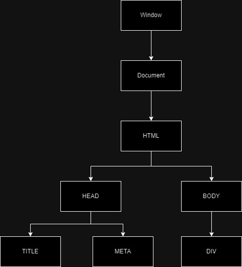

# DOM - Document Object Model

The Document Object Model (DOM) is the programming interface for web documents. It represents the structure of a document as a tree, enabling developers to interact with and manipulate content, structure, and styling dynamically.

---

## DOM Tree

The DOM is structured as a tree of nodes, with each element in the HTML represented as a node. Here is a visualization:



---

## DOM Selectors, NodeList, and HTMLCollection

The DOM API offers several methods to select elements, each with specific use cases and characteristics. Below, we detail these selectors and provide examples to clarify their usage.

### DOM Selectors

#### 1. **getElementById**

The `getElementById()` method retrieves an element by its unique `id`.

```js
// Example HTML: <h1 id='title' class='heading'>DOM Intro</h1>

const title = document.getElementById('title');
console.log(title);
// Output: <h1 id='title' class='heading'>DOM Intro</h1>

console.log(title.id);
// Output: title

console.log(title.class);
// Output: undefined

console.log(title.className);
// Output: heading

console.log(title.getAttribute('id'));
// Output: title

console.log(title.getAttribute('class'));
// Output: heading

title.setAttribute('class', 'test');
console.log(title);
// Output: <h1 id='title' class='test'>DOM Intro</h1>

title.style.padding = '1px';
// Adds 1px padding to the title element.
```

#### 2. **textContent vs innerHTML vs innerText**

These properties retrieve or modify the content of an element, but they behave differently.

```js
const title = document.getElementById('title');
console.log(title);
// Output: <h1 id='title' class='heading'>DOM Intro <span style="display:none">Test</span></h1>

console.log(title.textContent);
// Output: 'DOM Intro Test'

console.log(title.innerText);
// Output: 'DOM Intro'

console.log(title.innerHTML);
// Output: 'DOM Intro <span style="display:none">Test</span>'
```

#### 3. **querySelector**

`querySelector()` selects the first element that matches a CSS selector. If no matches are found, it returns `null`.

#### 4. **querySelectorAll**

`querySelectorAll()` retrieves all matching elements as a static `NodeList`. This list is not live and does not reflect changes made to the DOM after the selection.

---

### Example Code and Output

Consider the following HTML:

```html
<div>
  <h1 id="title" class="heading">
    DOM learning<span style="display: none;">test text</span>
  </h1>
  <h2>Lorem ipsum dolor sit.</h2>
  <h2>Lorem ipsum dolor sit.</h2>
  <h2>Lorem ipsum dolor sit.</h2>
  <p>Lorem ipsum dolor sit amet.</p>
  <input type="password" name="" id="" />

  <ul>
    <li class="list-item">one</li>
    <li class="list-item">two</li>
    <li class="list-item">three</li>
    <li class="list-item">four</li>
  </ul>
</div>
```

```js
// Selecting the first <h2> element.
console.log(document.querySelector('h2'));
// Output: <h2>Lorem ipsum dolor sit.</h2>

// Selecting elements by ID and class.
console.log(document.querySelector('#title'));
// Output: <h1 id="title" class="heading">...</h1>
console.log(document.querySelector('.heading'));
// Output: <h1 id="title" class="heading">...</h1>

// Selecting an <input> element with a specific attribute.
console.log(document.querySelector('input[type="password"]'));
// Output: <input type="password" name="" id="" />

// Manipulating an <li> element.
const turnGreen = document.querySelector('li');
turnGreen.style.backgroundColor = 'green';
turnGreen.innerText = 'three green';

// Working with NodeList (static).
const tempLiList = document.querySelectorAll('li');
console.log(tempLiList);
// Output: NodeList(4) [li, li, li, li]

// Updating styles for NodeList items.
tempLiList.forEach((li) => (li.style.backgroundColor = 'red'));

// Working with HTMLCollection (live).
const tempClassList = document.getElementsByClassName('list-item');
console.log(tempClassList);
// Output: HTMLCollection(4) [li.list-item, li.list-item, li.list-item, li.list-item]

// Converting HTMLCollection to an array.
const myConvertedArray = Array.from(tempClassList);
myConvertedArray.forEach((li) => (li.style.color = 'orange'));
```

---

### Notes:

- **Static vs Live Collections**: `querySelectorAll()` returns a static NodeList, while `getElementsByClassName` returns a live HTMLCollection that reflects changes in the DOM.
- **Array Methods Compatibility**: NodeList supports `forEach()`, but HTMLCollection does not. Convert HTMLCollection to an array for using methods like `map` or `forEach`.
- **Performance Considerations**: Use `querySelector` and `querySelectorAll` for flexibility and modern syntax, but prefer `getElementById` for faster, unique ID-based selection.

---

By understanding these selectors and methods, you can efficiently traverse and manipulate the DOM to create dynamic and interactive web applications.
